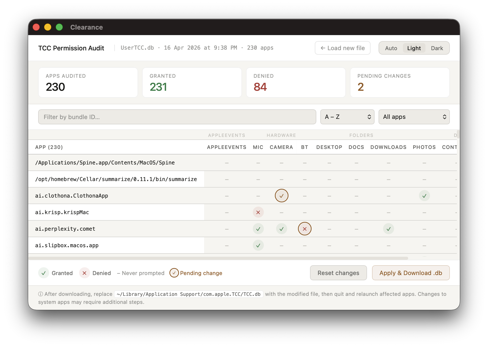
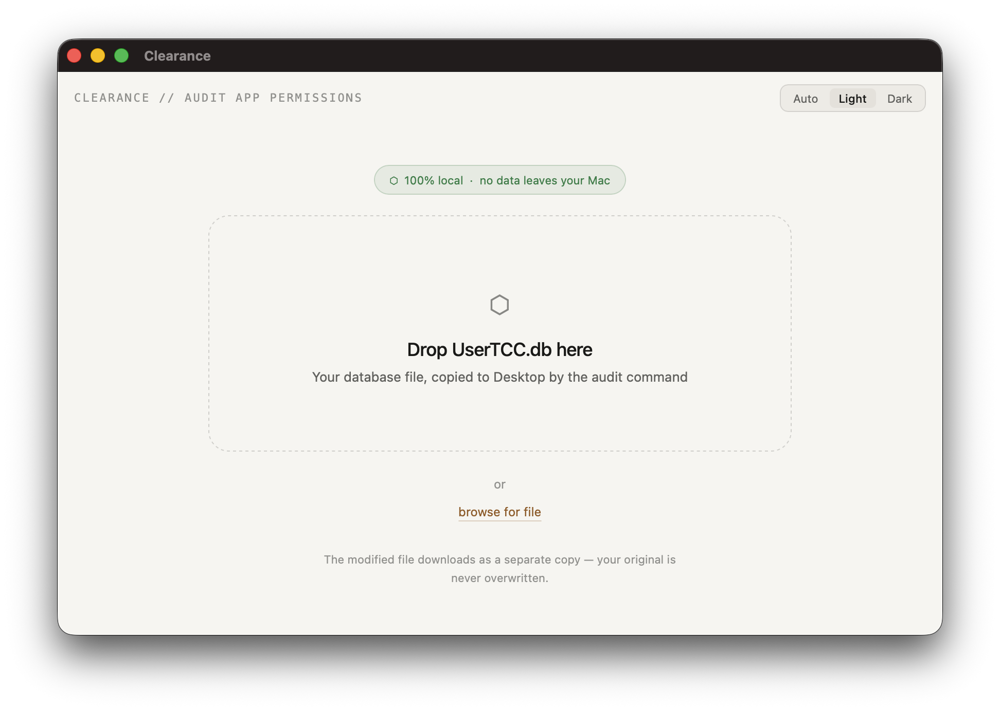
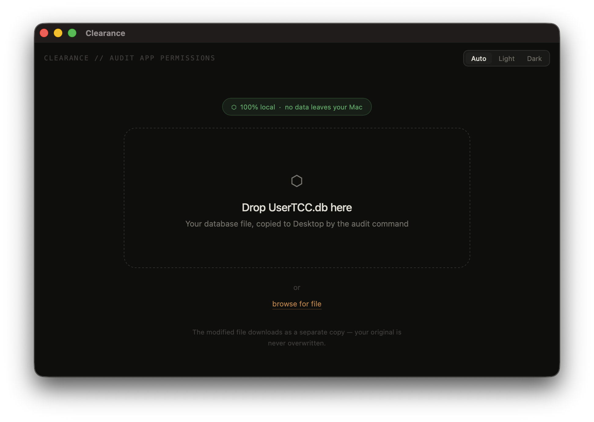
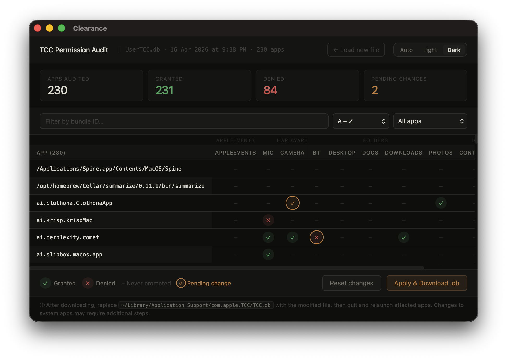
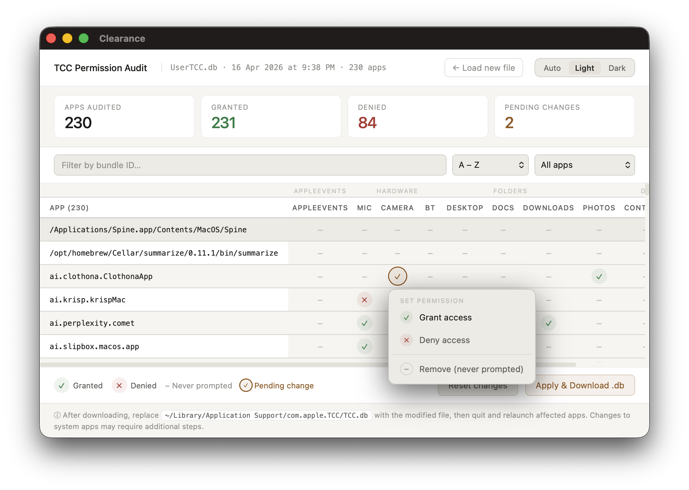
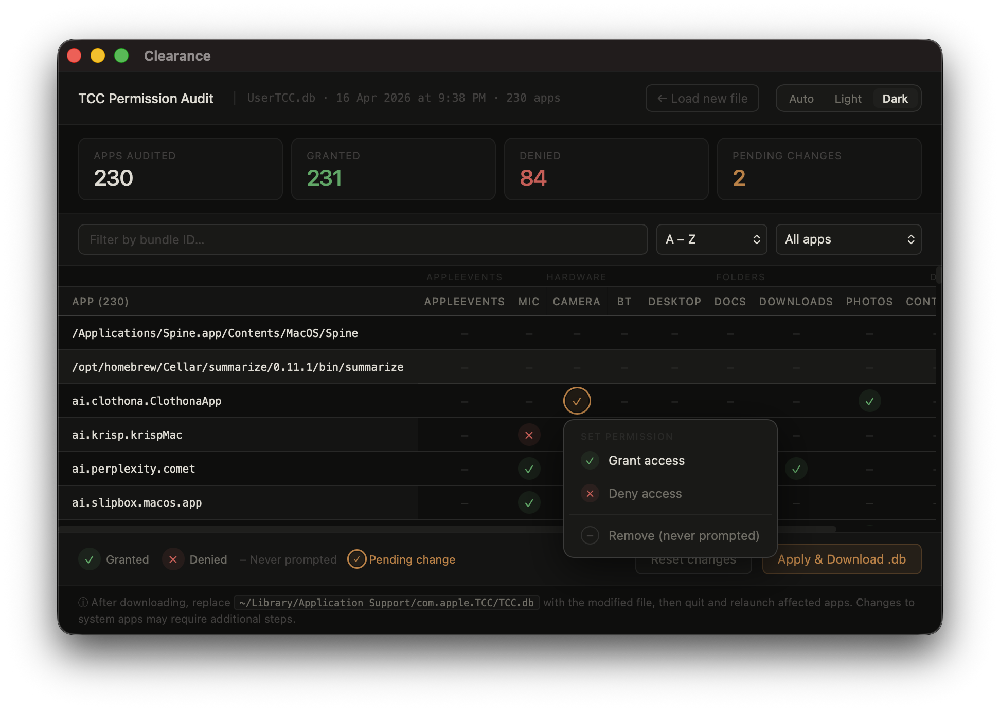

# Clearance 
Review your Mac apps' privacy permissions, including the ones you don't know about.



[](https://www.apple.com/macos/)
[](https://swift.org)
[](LICENSE)
[](https://github.com/cch1rag/Clearance/releases/latest)

A native macOS privacy manager for reading and editing app permissions stored in Apple's TCC (Transparency, Consent, and Control) database. Local-first, no telemetry, and no cloud sync.

> **Safety first:** Always work on a copy of `TCC.db`, not the live database.

---

## What is TCC?

Every time macOS asks "Allow this app to access your contacts?" your answer is saved in a SQLite database called TCC.db. TCC stands for Transparency, Consent, and Control — it is Apple's framework for managing app access to sensitive resources like the camera, microphone, location, contacts, and more.

The database lives at:

```
~/Library/Application Support/com.apple.TCC/TCC.db
```

Clearance lets you open that database, browse every permission row in a searchable table, and edit or revoke entries — no terminal required.

---

## Features

- Browse all TCC permission entries in a sortable, filterable table
- Edit permission values inline — click any cell to change it
- Revoke or grant access by modifying the `auth_value` column (0 = deny, 2 = allow)
- Filter by service (`kTCCService`), app bundle ID, or access type
- Dark and light mode, follows system appearance automatically
- Export the full table as a CSV file
- Local-first: no analytics, no accounts, and no backend service

---

## Install

### Option A — Download a release

1. Go to the [latest release](https://github.com/cch1rag/Clearance/releases/latest)
2. Download the latest macOS release asset, if one is available
3. Unzip it and drag `Clearance.app` into `/Applications`
4. Launch the app from `/Applications`

#### First launch warning

On first launch, macOS may display a warning that the app is dangerous, with options to **Move to Trash** or **Done**. Click **Done**, then go to **System Settings → Privacy & Security** and click **Open Anyway**.

If no release is published yet, use Option B.

### Option B — Build from source

Requirements: macOS 12+, Xcode 15 or later

```bash
git clone https://github.com/cch1rag/Clearance.git
cd Clearance
open Clearance.xcodeproj
```

Press **⌘R** to build and run. No dependencies are required for a normal build. If you edit `project.yml`, regenerate `Clearance.xcodeproj` first with `xcodegen generate`.

---

## How to Use

1. Make a copy of your TCC database — never open the live file directly:

   ```bash
   cp ~/Library/Application\ Support/com.apple.TCC/TCC.db ~/Desktop/TCC-copy.db
   ```

2. Open **Clearance** from your Applications folder.

3. Click **Open Database** and select the copy you just made.

4. Browse and filter the permission table. Click any row to edit values inline.

5. To apply changes to the real database, quit any apps that hold a lock on TCC.db, then replace the original with your edited copy:

   ```bash
   cp ~/Desktop/TCC-copy.db ~/Library/Application\ Support/com.apple.TCC/TCC.db
   ```

   > This step requires SIP (System Integrity Protection) to be off for system-level entries. User-level entries in the copy can be edited freely.

---

## Privacy

Clearance operates on files you explicitly choose on your Mac. It does not upload databases, use analytics, require an account, or depend on a backend service.

Clearance bundles [sql.js](https://github.com/sql-js/sql.js) 1.10.3 and its WASM file inside the app, so the shipped app does not need internet access to open or edit databases.

Clearance never reads your actual TCC database automatically — you choose which file to open.

---

## Built With

- Swift and AppKit for the native macOS shell
- WKWebView to host the interactive table UI
- Bundled [sql.js](https://github.com/sql-js/sql.js) 1.10.3 (SQLite compiled to WebAssembly) for parsing `.db` files in the web layer
- Vanilla HTML, CSS, and JavaScript — no frontend frameworks

---

## More screenshots

<table>
  <tr>
    <td></td>
    <td></td>
    <td></td>
  </tr>
  <tr>
    <td></td>
    <td></td>
    <td></td>
  </tr>
</table>

---

## Author

**Chirag Chopra** — [github.com/cch1rag](https://github.com/cch1rag)

---

## License

MIT — see [LICENSE](LICENSE) for details.
